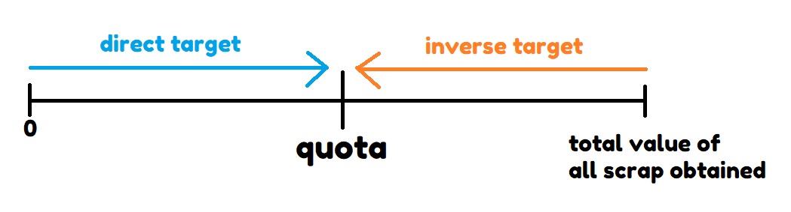
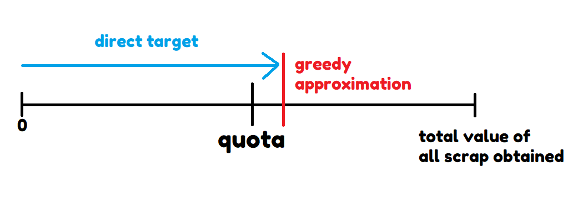

# MinimumQuotaFinder
Co-created by [@Luesewr](https://github.com/Luesewr) and [@riceisacereal](https://github.com/riceisacereal)\
[Thunderstore](https://thunderstore.io/c/lethal-company/p/PotatoCoders/MinimumQuotaFinder/) | [Github](https://github.com/riceisacereal/MinimumQuotaFinder)

This mod calculates and highlights the minimum total value of scraps that you can sell to still reach the quota. **The default key to toggle the highlighting is `H`**, but this can be changed in the settings.

The same in essence as: [ScrapCalculator](https://thunderstore.io/c/lethal-company/p/granny/ScrapCalculator/), [CalculateScrapForQuota](https://thunderstore.io/c/lethal-company/p/Jazzy/CalculateScrapForQuota/)\
Scrap auto-selling mods: [SellMyScrap](https://thunderstore.io/c/lethal-company/p/Zehs/SellMyScrap/), [SellFromTerminal](https://thunderstore.io/c/lethal-company/p/stormytuna/SellFromTerminal/)

## ✨ 𝓦𝓱𝓪𝓽 𝓸𝓾𝓻 𝓶𝓸𝓭 𝓭𝓸𝓮𝓼 𝓫𝓮𝓽𝓽𝓮𝓻
- Always finds the most optimal answer quickly (5ms to 1s depending on quota and number of items) using an [optimized algorithm](#explanation-of-algorithm). ([CalculateScrapForQuota](https://thunderstore.io/c/lethal-company/p/Jazzy/CalculateScrapForQuota/) does use the same algorithm, but other similar mods we've found all use a non-optimal algorithm)
- Cool highlighting shader ✨

## How the mod works
- **Press `H` to toggle the highlighting/recalculate**
  - The keybind can be changed in the settings.
- Calculation always assumes that you are selling when the company is **buying at 100%**. See [this section](#buying-rate-calculation) why.
- Starting from `v1.1.0`, calculation is disabled on the company moon when buying rate is < 100%
- When you're on the company moon, all scrap in the environment is taken into account (including scrap on the counter), unless **its y-value is under -30** (somehow dropped over the railings). Otherwise only scrap within the ship is considered.
  - Pros: You can take items outside the ship on the company moon and they will still be included in the calculation.
- Starting from `v1.1.1`, Shotguns, Ammo, and Gifts are excluded from the calculation by default.
- If you accidentally sold unhighlighted scrap, press H (or the key you rebound it to) to recalculate.
  - Starting from `v1.1.0`, the mod will automatically re-calculate when you accidentally sold the wrong scrap
- This is a client-side mod, which means that there is a small chance of different items being highlighted for different people. We have several methods in place to prevent this from happening, but you never know.
  - If this happens, report an issue and tell us how it happened.

## Explanation of Algorithm
### The problem
The problem this mod tries to solve - finding the most optimal combination of scrap that is the closest to the quota, is a variant of the [subset sum problem](https://en.wikipedia.org/wiki/Subset_sum_problem) and has a computational complexity of [NP-Hard](https://en.wikipedia.org/wiki/NP-hardness), which in a very simplified way of saying means that there is no easy formula to get the answer right away and that we have to find it by "trying every combination".

The number of possible combinations for all the scrap you have grows [exponentially](https://math.stackexchange.com/a/3788314), by the time you have 20 pieces of scrap you will have to check over 1 million combinations, and 1 billion when you have 30 pieces of scrap. When you're up to 5k+ quota it will take half your lifetime to check all combinations with even if you check 1 million combinations per second.

Algorithms for NP-hard problems utilize ways to [ignore certain combinations](https://en.wikipedia.org/wiki/Decision_tree_pruning), and [storing the results of calculations that are repeated multiple times](https://en.wikipedia.org/wiki/Memoization). An example of the former would be, if you have a quota of 1000, and we know that the highest value a scrap can have is 210, we could ignore any combinations that have less than 5 pieces of scrap, since they would never reach the quota (4 * 210 = 840 < 1000).

### The Algorithm
The algorithm we've implemented is very similar to the solution to the [0-1 knapsack problem](https://en.wikipedia.org/wiki/Knapsack_problem#0-1_knapsack_problem) which uses dynamic programming and memoization. The only difference is that the knapsack problem tries to find the maximum <= a threshold, and since we need the minimum of >= quota, we ran the knapsack solution on a threshold of (total value of scrap owned - quota) to find what we should *exclude*. (Thanks to [this](https://stackoverflow.com/a/17181101) Stackoverflow answer for the idea.)

From v1.1.0 onwards, we've made an optimization where a direct target (opposite of inverse target) is used when the inverse target in larger than the quota. Previously, if you had a quota of `1k` and total scrap value of `18k`, the algorithm would calculate towards the inverse target `18k - 1k = 17k`, with around `17k` * `number of items` calculations. Now, the algorithm approximates a direct target using a [Greedy](https://en.wikipedia.org/wiki/Greedy_algorithm) approximation to attempt to minimize the calculations needed. This way, there would only be around `1k + (the max value of a scrap - 1)` * `number of items` calculations needed. More explanation can be found in the next section.

### Greedy Approximation for direct target (v1.1.0 onward)
Using an inverse target makes it so that the algorithm can get to the quota as close as possible by calculating what to exclude, using a direct target instead calculates what to include.

The problem here is that the solution algorithm finds an answer that is <= the target. This is fine when using an inverse target, since we find what to exclude first and use that to determine what to include, which ends up always being >= quota, but when directly finding what to include with the quota as a target, if there is no combination that is exactly equal to quota, it will find a combination less than the quota. Therefore we need to set a higher target than the quota in case the best combination is `quota + 1`, or `quota + 2`, or `quota + 3`, then comes the question, how high do we set the direct target?

A reliable way to find a good direct target is to find any combination of scrap where the sum is bigger or equal to the quota, since we are sure that it is at least possible to reach that target with this combination. To find this combination, we use a [greedy](https://en.wikipedia.org/wiki/Greedy_algorithm) approach to get a quick combination that tries to not overshoot the quota by too much.

### Computation Time Scaling
The 2 factors that determine how long it takes to calculate an answer are the value of the quota, the number of scrap, and the total value of that scrap. The algorithm goes through a table the size of (total value of scrap owned - quota) * number of scrap, so the bigger the difference between your quota and the total value of all your scrap, and the more scrap you have, the longer it takes to calculate.

### Performance Impact
To prevent the game from freezing while doing large calculations, the mod makes use of [coroutines](https://docs.unity3d.com/Manual/Coroutines.html). These coroutines spread out the calculations over multiple frames and limit the number of computations ran per frame for a smoother user experience.

## Buying Rate Calculation
The way the buying rate is considered when selling things is by multiplying the total value of everything on the counter by the buying rate, and then getting rid of the decimals. (The result gets assigned to an integer, so 1.1 becomes 1, and 1.8 also becomes 1).

Of course, we could calculate every item's actual buying price beforehand, but the algorithm only works with integers so we have get rid of the decimals before calculation. Rounding up could cause undershooting, normal rounding doesn't guarantee everything adds up again, and rounding down would cause overshooting. (The amount it overshoots by scales with the amount of scrap you are selling. Let's say on average you shave off 0.5 real value per scrap, if you sell 50 pieces of scrap you'll lose 25 company credits - about a whole piece of scrap.)

Aditionally, what makes calculation even more complicated is you can only put a limited number (12) of scrap on the counter to sell every time, which means that the order of batches you sell your scrap in also affects how much value you're losing.

To get the optimal answer in this situation, the problem then becomes "in what order of batches does one sell in to minimize scrap value loss", but that's a whole separate challenge which is too big in comparison to the problem it tries to solve. Since this mod is intended for min-maxing gameplay and we see no overwhelming reason that one would sell at a lower buying rate when approaching the game this way, currently we do not have plans to consider lower buying rates, and calculations will be disabled for buying rates < 100%.

## Credits
This mod was built using the [BepInEx mod template](https://docs.bepinex.dev/articles/dev_guide/plugin_tutorial/2_plugin_start.html). Part of [ShipLoot mod](https://github.com/tinyhoot/ShipLoot)'s code was taken as a starting point. [InputUtils](https://thunderstore.io/c/lethal-company/p/Rune580/LethalCompany_InputUtils/) was used to make the keybinding. This [Wireframe Shader](https://gist.github.com/baba-s/14ecab2df06188a083e66ab00b2c9499) was used as a basis for the custom wireframe shader.

## Installation
[Thunderstore link](https://thunderstore.io/c/lethal-company/p/PotatoCoders/MinimumQuotaFinder/)
